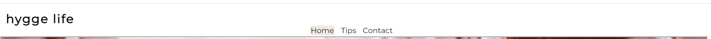
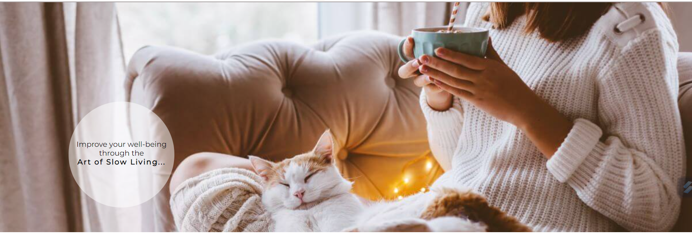
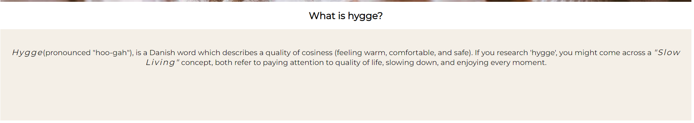
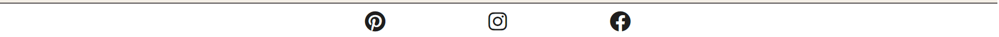
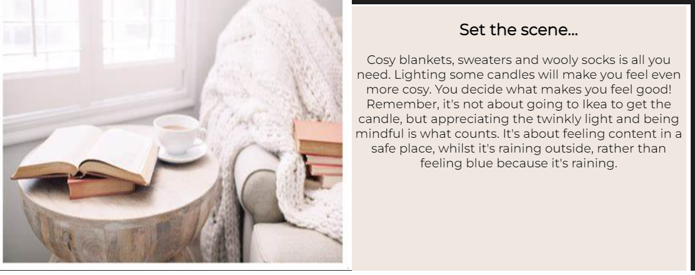
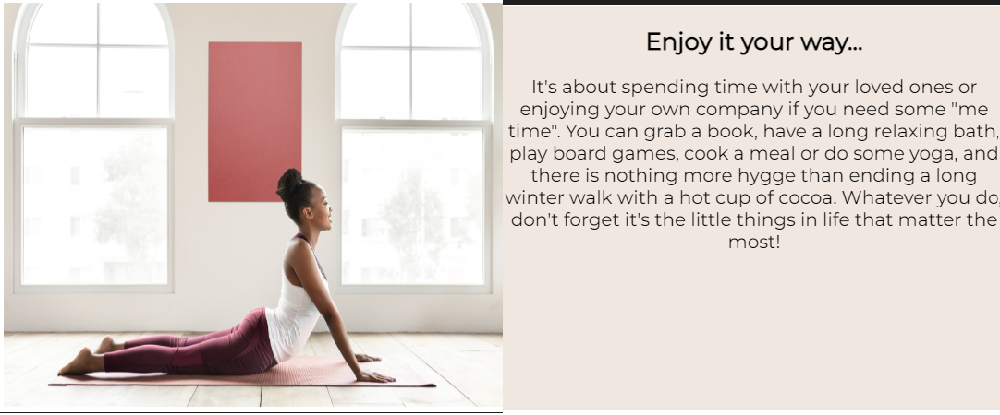
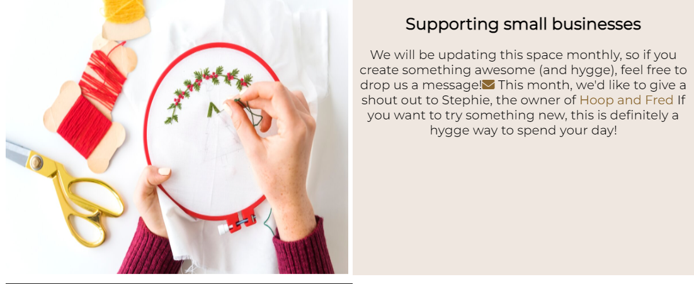
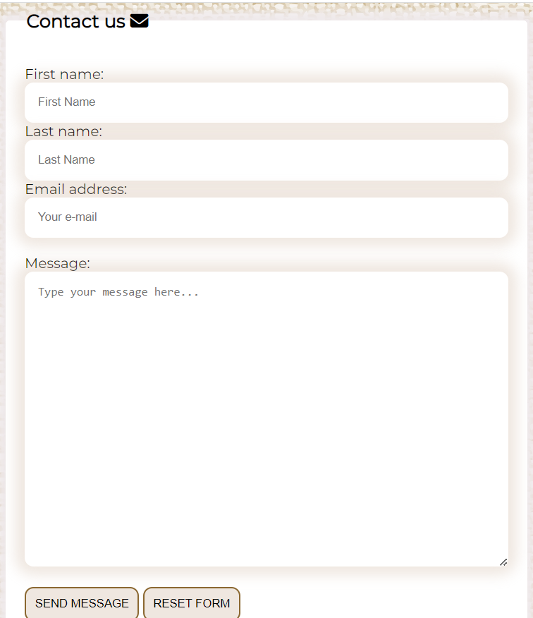

# Hygge Life
The aim of "Hygge Life" is to show that being happy is as easy as going back to basics. It's a reminder to slow down and notice the little, good things that happen to us each day. As simple as enjoying a cosy day indoors when it's miserable outside, appreciating being safe and warm, enjoying the sound of rain hitting your windows, rather than focusing on the bad weather. 
The site is aimed towards people who never stop, and feel overwhelemed by everything going on around them, maybe searching for something to bring them peace. It will include sections with ideas on how to spend nice relaxing time in a way that let's them recharge for a busy, everyday life. 
The site has a clean, simple design with warm colour pallete and cosy images to make users feel welcome and relaxed.
---
SPACE FOR MOCKUP SCREENSHOT
---
## Features
---
### Existing Features
- #### Navigation bar
This is shown the same on every page for ease of navigating the page and good user experience. The bar includes: page logo and three links: Home, Tips and Contact, easily taking users through to relevant page.  
The logo includes a link to home page, this link is active from pages: Tips and Contact. It is not included on Home page to not confuse the user.

- #### Landing page image
This is a main image for the page. The aim of the image is to instantly let the user know that they enetered relaxing environment. It's warm and cosy. The image includes a text overlay which indicates that the goal of the page is to improve users wellbeing and slow down.

- #### What is hygge section within "home" page
This section includes a brief description of "hygge" meaning. It allows the user to understand the main focus of the page and therefore what to expect in further sections.

- #### About section within "home" page
This section has a brief explanation of what is the aim of the page. It encourages the user to have a positive outlook on life, using positive and direct language to make the user feel like they are not on their own. The aim of the section is to show the value of digging deeper into the subject and includes a link to "Tips" page for a quick start on a new journey.

- #### Footer
Just like the Navigation bar, the footer shows exactly the same on every page for consistent design, therefore better user experience. 
The footer includes three links to connect with Hygge Life through social media pages. These will open in new tabs so that the customer doesn't leave our page too soon. Joining us on social media will not only encourage the user to keep connected but also allows them to enter like minded community.

- #### Tips page
This page consists of three sections. Each of the sections takes users through the hygge life routine in a simple way so that they can focus on one step at the time. The flip boxes allow us to create this experience.  
The user will hover over the image to reveal the back of the box showing the text. When hovered over next image the text from first box will go back to show an image, revealing only text from second box and so on.

1. Set the scene flip-box (front/back)

This box will provide first step on how to prepare to live a hygge life. The value of this content is that the users will see they don't need to spend any money to start their journey.
2. Get cosy flip-box (front/back)

This box will provide a second step, which is a few ideas of activities the users can do to calm their mind and enjoy life. The value of the content is that the users will see they don't have to follow any "fad news". They can continue on doing what makes them happy but need to start paying attention to being mindful whilst doing so.

3. Supporting small businesses flip- box (front/back)

This box will provide an additional support for users. Not only it will give them an interesting ideas on how to spend their day the hygge way so that they don't have to spend their valuable time on searching the internet, but also will provide support for independent businesses by showcasing their websites. 
It provides a link to the Contact page, so that anyone who would like to have their work featured can get in touch, as well as a link to the website of the business we think is worth a mention.
- Contact page
This page includes a contact form, users can get to this page by clicking "Contact" link in Nav bar from any other page or by clicking an envelope icon shown in box three within "Tips" page.
The users will need to provide their name, surname and e-mail address before submitting a message. They can provide any details about the business or creative work they do if they would like to be mentioned on Hygge Life website.

