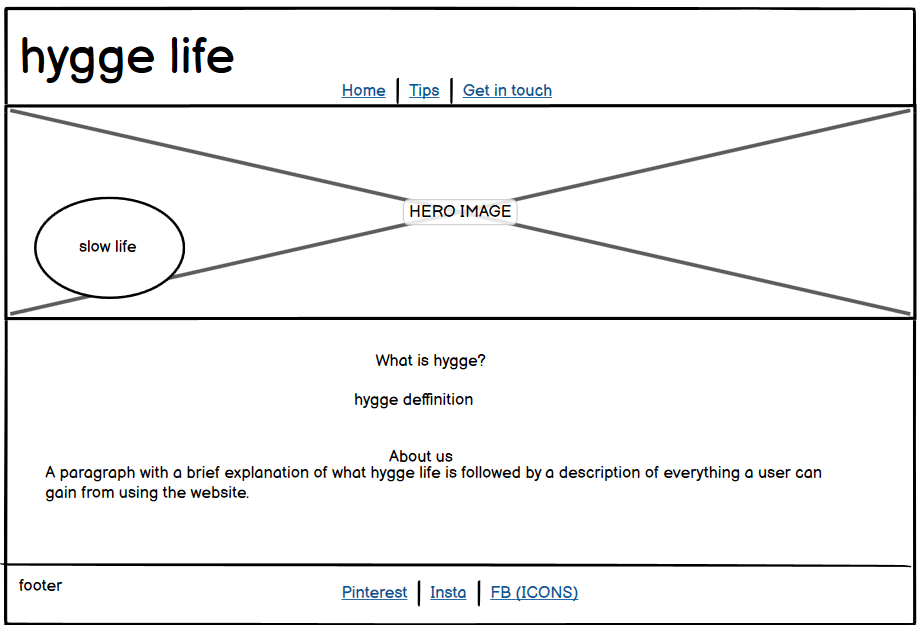
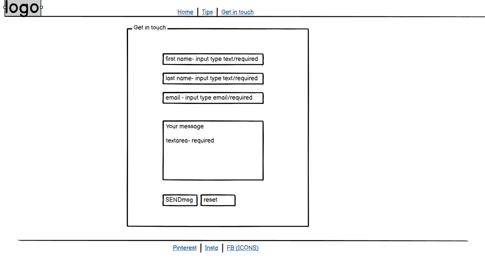
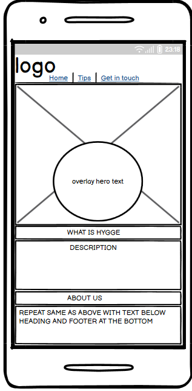
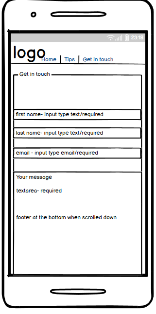

<h1>Hygge Life</h1>
   
The aim of "Hygge Life" is to show that being happy is as easy as going back to basics. It's a reminder to slow down and notice the little, good things that happen to us each day. As simple as enjoying a cosy day indoors when it's miserable outside, appreciating being safe and warm, enjoying the sound of rain hitting your windows, rather than focusing on the bad weather.

   
The site is aimed towards people who never stop, and feel overwhelemed by everything going on around them, maybe searching for something to bring them peace. It will include sections with ideas on how to spend nice relaxing time in a way that let's them recharge for a busy, everyday life.

   
The site has a clean, simple design with warm colour pallete and cosy images to make users feel welcome and relaxed.

<h2>SPACE FOR MOCKUP SCREENSHOT</h2>

<h2>FEATURES</h2>
   <ul>
      <h3>Existing Features</h3>
      <li>
         <h4>Navigation bar</h4>
      </li>
         <ul>
             <li>This is shown the same on every page, always in the centre regardless of screen size. The bar includes: page logo and three links: Home, Tips and Contact. The logo includes a link to home page, this link is active from pages: Tips and Contact.
             </li>
             <li>It allows the user to easily navigate through the page. links are always in the centre of the page regardless of the screen size making it easy to find. The logo doesn't include the link within home page to not confuse the user.
             </li>
             
         </ul> 
      <li>Landing page image
      </li>
         <ul>
             <li>This is a main image for the page. It's warm and cosy. The image includes a text overlay which indicates that the goal of the page is to improve users wellbeing and slow down.
             </li>
             <li> The aim of the image is to instantly let the user know that they enetered relaxing environment. The text over the image tells the user what content to expect on the page.
             </li>
             
            </ul>
      <li> What is hygge- section within "home" page
      </li>
            <ul>
              <li>This section includes a brief description of "hygge" meaning.
              </li> 
              <li>It allows the user to understand the main focus of the page and therefore what to expect in further sections.
              </li>
              
            </ul>
       <li>About- section within "home" page
       </li>
            <ul>
               <li>This section has a brief explanation of what is the aim of the page. Includes a link to "tips" page. 
               </li>
               <li>It encourages the user to have a positive outlook on life, using positive and direct language to make the user feel like they are not on their own. The aim of the section is to show the value of digging deeper into the subject. The link to "Tips" page is there for a quick start on a new journey.
               </li>
               
            </ul>
     <li>Footer
     </li>
             <ul>
                 <li>
                  Just like the navigation bar, the footer shows exactly the same on every page. It includes three links to connect with Hygge Life through social media pages. These will open in new tabs, so that the customer doesn't leave our page too soon.for consistent design, therefore better user experience.
                  </li>
                  <li>
                   The consistent design provides better user experience. Joining us on social media will not only encourage the user to keep connected but also allows them to enter like minded community.
                   </li>
                   
            </ul>
      <li> Tips page
      </li>
         <ul>
             <li>This page consists of three sections. Each of the sections takes users through the hygge life routine in a simple way so that they can focus on one step at the time. The flip boxes allow us to create this experience.
             </li>
             <li>The user will hover over the image to reveal the back of the box- showing the text. When hovered over next image the text from first box will go back to show an image, revealing only text from second box- and so on.
             </li>
         </ul>
         <ol>
             <li> Set the scene flip-box (front/back)
             </li>
                   
                 <ul>
                     <li>This box will provide first step on how to prepare to live a hygge life.
                     </li> 
                     <li>The value of this content is that the users will see they don't need to spend any money to start their journey.
                     </li>
                 </ul>
              <li>Get cosy flip-box (front/back)
              </li>
                   
                 <ul>
                     <li>This box will provide a second step, which is a few ideas of activities the users can do to calm their mind and enjoy life.
                     </li>
                     <li>The value of the content is that the users will see they don't have to follow any "fad news". They can continue on doing what makes them happy but need to start paying attention to being mindful whilst doing so.
                     </li>
                 </ul>
              <li>Supporting small businesses flip- box (front/back)
              </li>
                  
                  <ul>
                       <li>This box will provide an additional support for users. Not only it will give them an interesting ideas on how to spend their day the hygge way, but also it will provide support for independent businesses by showcasing their websites.
                       </li>
                       <li>The value of this is that the users won't have to waste their valuable time on searching through internet if they only just starting their journey and aren't quite sure what to look for. Another one is an easy way to showcase their small businesses and creative side.
                       </li>
                       <li>
                       It provides a link to the Contact page, so that anyone who would like to have their work featured can get in touch, as well as a link to the website of the business we think is worth a mention.
                       </li>
                 </ul>
          </ol>
      <li>Contact page
      </li>
           <ul>
               <li>This page includes a contact form. Users can get to this page by clicking "Contact" link in Nav bar from any other page or by clicking an envelope icon shown in flip-box three within "Tips" page. 
               The users will need to provide their: name, surname and e-mail address before submitting a message. All fields are required. 
               </li>
               <li>Users can provide any details about the business or creative work they do, if they would like to be mentioned on Hygge Life website.
               </li>
               
          </ul>
  </ul>
<h3>Features left to implement</h3>
    <ul>
        <li>In the future I would like to update contact form so that it is a working feature. At the moment no javascript has been applied.
        </li>
        <li>Inspirations 
        In the future I would like to create another page for the project showing an inspiration wall. This would be videos and different pages I'd like to embed within the page. Yoga practice, meditation, cooking classes, interior design ideas, day in life videos showing the users how others stay happy living life to the fullest. The users would benefit from the page simply by having easy access to all the above and also by being able to share what inspires them the most.
        </li>
  </ul>
<h2>DESIGN</h2>
   <ul>
       <li>Medium to large screen wireframe
       </li>
          <ul>
             <li>Home page
             
             </li>
             <li>Tips page
             
             </li>
             <li>Contact page
             
             </li>
         </ul>
        <li>Small screen wireframe
        </li>
            <ul>
                <li>Home page 
                 
                </li>
                <li>Tips page 
                 
                </li>
                <li>Contact page 
                 
                </li>
            </ul>
   </ul>
<h2>TESTING</h2> 
    <h3>Responsiveness</h3>
    ,<h3>Accessibility</h3>
    Each page checked with the help of WAVE Accessibility tool. Each page passes accesibility test with no error. 
    CHECK THE ARIA LABEL REPEAT WARNING!!!!!!!!!!!!!!!!!!!!!!!!!!!!!!!!
    <h3>Functional Testing</h3>
       <ul>
          <li>Navigation bar links</li>
          All liks have been checked from each page to make sure they take us to correct page. All links work as expected.
          <li>Links within the narrative</li>
          Internal links checked to make sure they take us to correct page. All links work as expected. External links clicked on to check they open in new tab and take us to correct page. All links work as expected.
          <li>Footer links</li>
          All social media links checked from each page. All links work as expected, take us to correct page and open in new tab.
        </ul>
    <h3>Validator testing</h3>
        <ul>
            <li>HTML
             No errors were found when passing through the official WSC Validator
            </li>
            <li>CSS
             No errors were found when passing through the official Jigsaw W3 Validator
             </li>
        </ul>
    <h3>Unfixed bugs</h3>
<h2>DEPLOYMENT</h2>
<h2>CREDITS</h2>
   <ul>
       <li>Google Fonts
       </li>
       <li>rawpixel.com - all images used apart from the hero image were from them.
       </li>
       <li>shutterstock.com - hero image
       <li>W3Schools.com - flip-box syntax, also used throughout the project for general help
       </li>
       <li>blog.logrocket.com -form styling help
       </li>
       <li>Love Running project
       </li>
       <li>dictionary.cambridge.org for hygge meaning
       </li>
       <li>google
       </li>
       <li>Font Awesome - for all icons used.
       </li>
       <li>https://github.com/Gareth-McGirr/tacos-travels - for help with Readme.
       </li>
       <li>My mentor Daisy McGirr for all the help
       </li>
  </ul>
<h2>TECHNOLOGIES</h2>
    <ul>
    <li>Balsamiq- used to create wireframes</li>
    <li>Github</li>
    <li>Gitpod</li>
    <li>HTML</li>
    <li>CSS</li>
    <li>Tiny PNG- used to compress the size of images</li>
    <li>Wave Evaluation Tool- used for checking accessibility</li>
    <li>Techsini.com- used for creating mockup image</li>
    <li>W3C Validator- used for checking HTML and CSS for errors</li>

