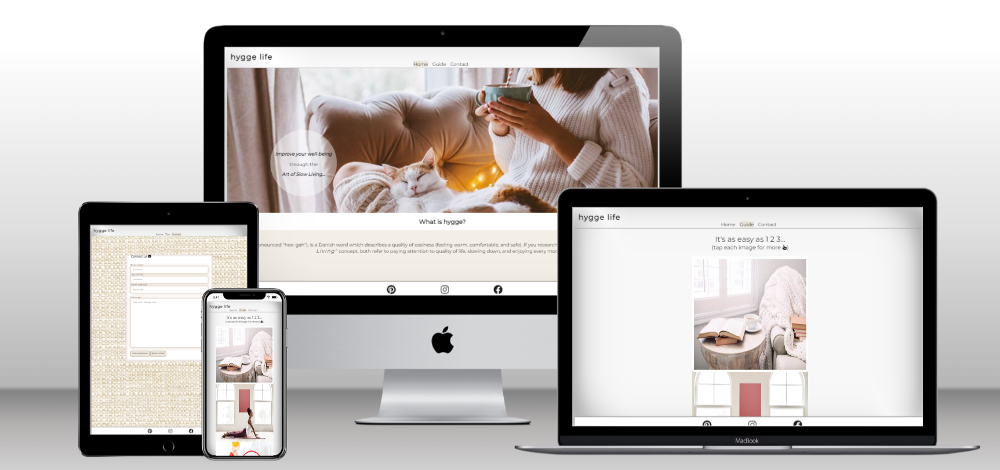
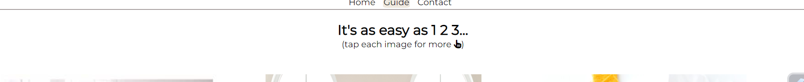
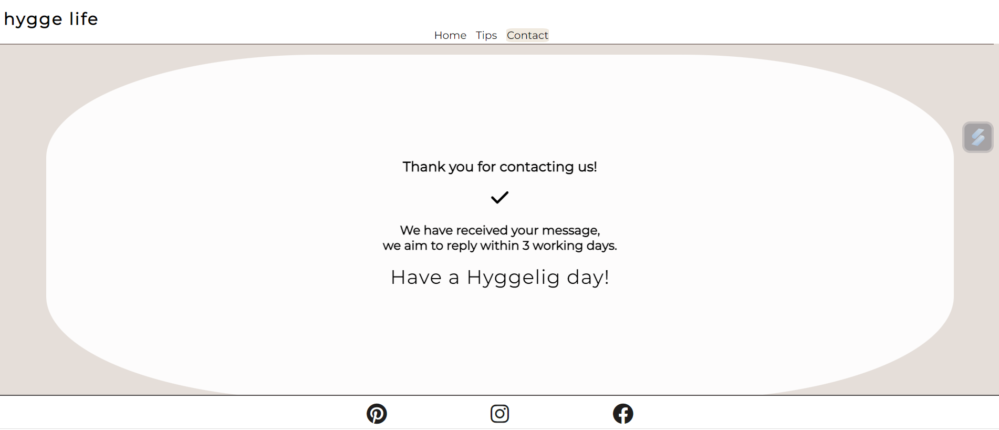
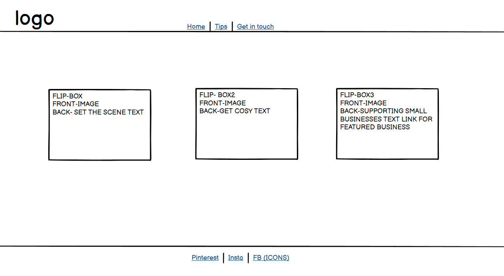
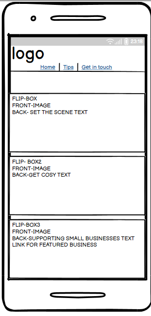
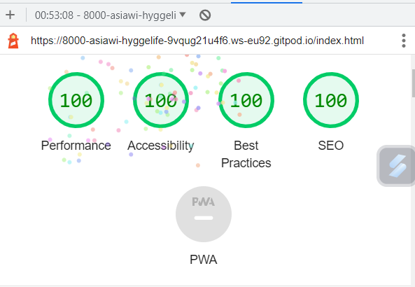
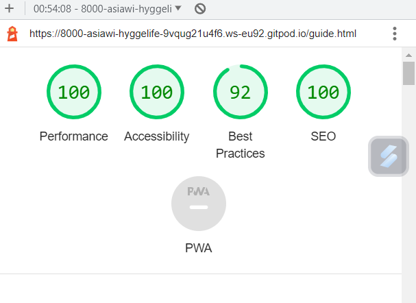
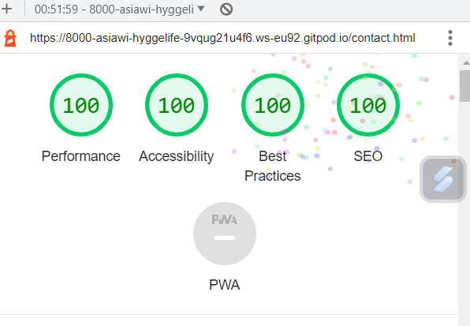

# Hygge Life
The aim of "Hygge Life" is to show that being happy is as easy as going back to basics. It's a reminder to slow down and notice the little, good things that happen to us each day. As simple as enjoying a cosy day indoors when it's miserable outside, appreciating being safe and warm, enjoying the sound of rain hitting your windows, rather than focusing on the bad weather. 
The site is aimed towards people who never stop, and feel overwhelemed by everything going on around them, maybe searching for something to bring them peace. It will include sections with ideas on how to spend nice relaxing time in a way that let's them recharge for a busy, everyday life. 
The site has a clean, simple design with warm colour pallete and cosy images to make users feel welcome and relaxed.

## FEATURES
4
Existing Features
### Navigation bar
* This is shown the same on every page, always in the centre regardless of screen size. The bar includes: page logo and three links: Home, Guide and Contact. The logo includes a link to home page, this link is active from pages: Guide and Contact.
* It allows the user to easily navigate through the page. links are always in the centre of the page regardless of the screen size making it easy to find. The logo doesn't include the link within home page to not confuse the user.

### Home page image
* This is a main image for the page. It's warm and cosy. The image includes a text overlay which indicates that the goal of the page is to improve users wellbeing and slow down.
* The aim of the image is to instantly let the user know that they enetered relaxing environment. The text over the image tells the user what content to expect on the page.

### What is hygge- section within "home" page
* This section includes a brief description of "hygge" meaning.
* It allows the user to understand the main focus of the page and therefore what to expect in further sections.

### About- section within "home" page
* This section has a brief explanation of what is the aim of the page. Includes a link to "guide" page. 
* It encourages the user to have a positive outlook on life, using positive and direct language to make the user feel like they are not on their own. The aim of the section is to show the value of digging deeper into the subject. The link to "Guide" page is there for a quick start on a new journey.

### Footer
* Just like the navigation bar, the footer shows exactly the same on every page;  It includes three links to connect with Hygge Life through social media pages. These will open in new tabs, so that the customer doesn't leave our page too soon.
* The consistent design provides better user experience. Joining us on social media will not only encourage the user to keep connected but also allows them to enter like minded community.

### Guide page
* This page consists of three sections. Each of the sections takes users through the hygge life routine in a simple way, so that they can focus on one step at the time. The flip boxes allow us to create this experience.
* To allow users who view the website on mobile devices/ devices with no hover option, a heading has been added to top of the page to inform the user of action required.

* The user will hover over the image (tap for devices with no hover option) to reveal the back of the box- showing the text. When hovered/tapped on next image, the text from first box will go back to show an image, revealing only text from second box- and so on.
    * Set the scene flip-box (front/back)

* This box will provide first step on how to prepare to live a hygge life.
* The value of this content is that the users will see they don't need to spend any money to start their journey.
   * Get cosy flip-box (front/back)

* This box will provide a second step, which is a few ideas of activities the users can do to calm their mind and enjoy life.
* The value of the content is that the users will see they don't have to follow any "fad news". They can continue on doing what makes them happy but need to start paying attention to being mindful whilst doing so.
    * Supporting small businesses flip- box (front/back)

* This box will provide an additional support for users. Not only it will give them an interesting ideas on how to spend their day the hygge way, but also it will provide support for independent businesses by showcasing their websites.
* The value of this is that the users won't have to waste their valuable time on searching through internet if they're only just starting their journey and aren't quite sure what to look for. Another one is an easy way to showcase their small businesses and creative side.
* It provides a link to the Contact page, so that anyone who would like to have their work featured can get in touch, as well as a link to the website of the business we think is worth a mention.
### Contact page
* This page includes a contact form. Users can get to this page by clicking "Contact" link in Nav bar from any other page or by clicking an envelope icon shown in flip-box three within "Guide" page.
The users will need to provide their: name, surname and e-mail address before submitting a message. All fields are required. 
* Users can provide any details about the business or creative work they do, if they would like to be mentioned on Hygge Life website.

* When sending a message through the contact form, user will be taken to confirmation; thankyou.html page, informing of successful submission.

### Features left to implement
* Contact page- in the future I would like to update contact form so that it is a working feature. At the moment no javascript has been applied. 
* Inspirations- in the future I would like to create another page for the project showing an inspiration wall. This would be videos and different pages I'd like to embed within the page. Yoga practice, meditation, cooking classes, interior design ideas, day in life videos showing the users how others stay happy living life to the fullest. The users would benefit from the page simply by having easy access to all the above and also by being able to share what inspires them the most.

## DESIGN
* Medium to large screen wireframe
     * Home page
             
     * Guide page
             
     * Contact page
             
* Small screen wireframe
     * Home page
               
      * Guide page
               
     * Contact page
               
## TESTING

### Responsiveness
Website has been checked for responsiveness through Development tools. In order to do this, the following steps have been taken:
1. Open browser
2. Navigate to Hygge Life https://asiawi.github.io/hygge_life/index.html
3. Right click anywhere on the page and go to "Inspect" to open Dev Tools
4. Click on drop down menu: "Dimensions: Responsive" and choose "Responsive"
5. Drag the side of the screen and change screen size, make sure the website looks good from 320px and up

* Expected- page is user friendly when viewing the website on small and large screens.
* Actual- After using flex-box to guide page, website looks good and images don't stretch, user can read full text on the back of flip-boxes. Footer has been set as fixed for consistent design. Website now is user friendly on all screen sizes.

* The following devices have been used to check responsiveness:
    * Iphone 13 Pro
    * Google Pixel 7 Pro 
    * Samsung Galaxy S5
    * Surface Pro
    * Asus Vivobook

### Accessibility
Each page checked with the help of WAVE Accessibility tool (https://wave.webaim.org/). Each page passes accesibility test with no error for:
* contrast
* aria- labels for users who use screen-readers
* alternative text as a function for screen readers or in events when images don't load
* structural elements - for users of assistive technology as well as visual and semantic meaning
* language of the document- for screen readers
### Manual Testing
Manual testing performed, to ensure website performs well on different browsers and devices.
* Browsers
    * Chrome
    * Safari
    * Microsoft Edge
    * Firefox
        * Issue: Contact form won't show any contrast for box-shadowing for each input when viewed on Safari.
        * Fix: I have changed the border for each input to more contrasting colour so that users can see each input line when filling in a form. Fix has been succesful.
* Devices
    * Iphone 13 Pro
    * Google Pixel 7 Pro 
    * Samsung Galaxy S5
    * Surface Pro
    * Asus Vivobook
         * Issue: Contact form won't show any contrast for box-shadowing for each input for iphone users due to using Safari.
         * Fix: I have changed the border for each input to more contrasting colour so that users can see each input line when filling in a form. Fix has been succesful. 
### Lighthouse
* HOME PAGE

* GUIDE PAGE

* CONTACT PAGE

### Functional Testing
* Navigation bar links
    * All liks have been checked from each page to make sure they take us to correct page. All links work as expected.

|NAVIGATION LINK| DESTINATION PAGE|
|---------------|-----------------|
|Home           | index.html      |
|Guide          | guide.html      |
|Contact        | contact.html    |

* Links within the narrative
    * Internal links checked to make sure they take us to correct page. All links work as expected. 
    * External links clicked on to check they open in new tab and take us to correct page. All links work as expected.

|LINK (location)                      | DESTINATION PAGE      | PAGE OPENS IN NEW TAB       |
|-------------------------------------|-----------------------|-----------------------------|
|Guide (home page/about section)      | guide.html            | no- as expected             |
|Contact (envelope icon/guide page)   | contact.html          | no- as expected             |
|Featured business link (guide page)  | featured business link| yes- as expected            |

* Footer links
    * All social media links checked from each page. All links work as expected, take us to correct page and open in new tab.

|SOCIAL MEDIA LINK/ ICON              | DESTINATION PAGE      | PAGE OPENS IN NEW TAB       |
|-------------------------------------|-----------------------|-----------------------------|
|Pinterest icon                       | www.pinterest.co.uk   | yes- as expected            |
|Instagram icon                       | www.instagram.com     | yes- as expected            |
|Facebook icon                        | www.facebook.com      | yes- as expected            |

* Form testing
    * Form has been tested to ensure all attributes work as expected.
    * All inputs (type=text, type=email)- set as "required", one or more fields missing and the "send message" option won't work- as expected.
    * Email field- won't be accepted if incorrect email form has been added-as expected
    * Reset form button- works as expected and clears any data added to form.
    * when all fields submitted correctly- user will be taken to thankyou.html page-as expected

### Validator testing
* HTML
 No errors were found when passing through the official WSC Validator
* CSS
No errors were found when passing through the official Jigsaw W3 Validator
### Unfixed bugs
* no box-shadowing visible when viewing the website on Safari, Currently added stronger border to view each field.

## DEPLOYMENT
The site was deployed to GitHub Pages.
1. Go to Github repo
2. Click on "Settings"
3. Click on "Pages"
4. scroll to "Build and deployment" section
5. Find sub-section "Branch"
6. From drop-down manu "select branch" choose source "main"
7. Click "Save"
8. Wait until you can see a link for deployed page within Github Page section:
  * Your site is live at https://asiawi.github.io/hygge_life/

## CREDITS
* google fonts
* rawpixel.com - all images used apart from the hero image were from them.
* shutterstock.com - hero image
* W3Schools.com - flip-box syntax, also used throughout the project for general help
* blog.logrocket.com -form styling help
* Love Running project
* dictionary.cambridge.org for hygge meaning
* google
* Font Awesome - for all icons used.
* https://github.com/Gareth-McGirr/tacos-travels - for help with Readme.
* My mentor Daisy McGirr for all the help
* Jonathan Zakrisson https://github.com/Jonathan97-web - for help with responsive design/ idea on flex-box for flip-boxes

## TECHNOLOGIES
* Balsamiq- used to create wireframes
* Github
* Gitpod
* HTML - used to create content of the website
* CSS- used for website styling
* Tiny PNG- used to compress the size of images
* Wave Evaluation Tool- used for checking accessibility
* Techsini.com- used for creating mockup image
* W3C Validator- used for checking HTML and CSS for errors

