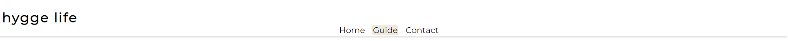
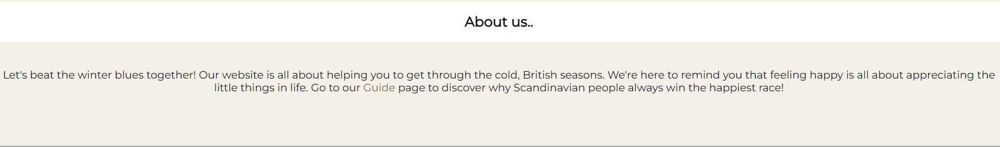

# Hygge Life
---
The aim of "Hygge Life" is to show that being happy is as easy as going back to basics. It's a reminder to slow down and notice the little, good things that happen to us each day. As simple as enjoying a cosy day indoors when it's miserable outside, appreciating being safe and warm, enjoying the sound of rain hitting your windows, rather than focusing on the bad weather. 
The site is aimed towards people who never stop, and feel overwhelemed by everything going on around them, maybe searching for something to bring them peace. It will include sections with ideas on how to spend nice relaxing time in a way that let's them recharge for a busy, everyday life. 
The site has a clean, simple design with warm colour pallete and cosy images to make users feel welcome and relaxed.
---
SPACE FOR MOCKUP SCREENSHOT
---
## Features
---
### Existing Features
- #### Navigation bar
This is shown the same on every page for ease of navigating the page and good user experience. The bar includes: page logo and three links: Home, Tips and Contact, easily taking users through to relevant page.  
The logo includes a link to home page, this link is active from pages: Tips and Contact. It is not included on Home page to not confuse the user.

- #### Landing page image
This is a main image for the page. The aim of the image is to instantly let the user know they enetered relaxing environment. It's warm and cosy. The image includes a text overlay which indicates that the goal of the page is to improve users wellbeing and slow down.

- #### What is hygge section within "home" page
This section includes a brief description of "hygge" meaning. It allows the user to understand the main focus of the page and therefore what to expect in further sections.

- #### About section within "home" page
This section has a brief explanation of what is the aim of the page. It encourages the user to have a positive outlook on life, using positive and direct language to make the user feel like they are not on their own. The aim of the section is to show the value of digging deeper into the subject and includes a link to "Tips" page for a quick start on a new journey.

- #### Footer
The footer includes three links to connect with Hygge Life through social media pages. These will open in new tabs so that the customer doesn't leave our page too soon. Joining us on social media will not only encourage the user to keep connected but also allows them to enter like minded community.

- Tips page
- Contact page